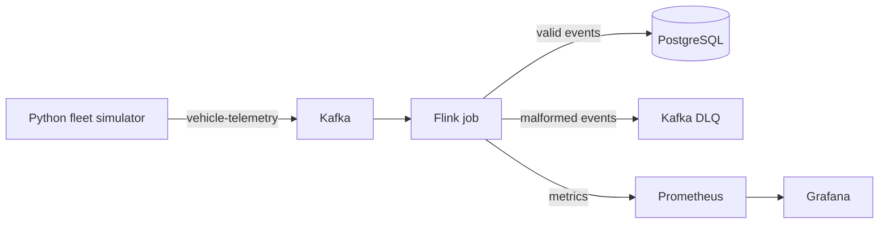

# Reliability Stream System

A local stream processing system for connected vehicle telemetry.

The project uses a Python simulator to publish telemetry events to Kafka, processes the stream with Apache Flink, stores valid events in PostgreSQL, and exposes Flink metrics through Prometheus/Grafana.

The Flink job handles common stream reliability cases:

- event-time processing with watermarks
- out-of-order events
- late events
- duplicate `event_id` suppression
- malformed event routing to a Kafka DLQ
- PostgreSQL idempotent writes
- TaskManager restart recovery

## Architecture



## Components

| Component | Description |
| --- | --- |
| `fleet-simulator` | Python producer that generates telemetry events and injects faults |
| `flink-job` | Java/Flink streaming job |
| `infra` | Docker Compose setup for Kafka, Flink, PostgreSQL, Prometheus, and Grafana |
| `scripts` | Startup, shutdown, and chaos test scripts |
| `docs` | Design notes |

## Tech Stack

- Java 17
- Apache Flink 1.18.1
- Kafka
- PostgreSQL 16
- Python 3
- Docker Compose
- Prometheus
- Grafana
- Maven

## Repository Layout

```text
.
├── docs/
│   └── design.md
├── fleet-simulator/
│   ├── requirements.txt
│   └── src/generator.py
├── flink-job/
│   ├── pom.xml
│   └── src/main/java/com/vehicletelemetry/
│       ├── TelemetryJob.java
│       ├── model/TelemetryEvent.java
│       ├── serde/TelemetryEventDeserializer.java
│       └── sink/PostgresSink.java
├── infra/
│   ├── docker-compose.yml
│   └── prometheus/prometheus.yml
└── scripts/
    ├── start.sh
    ├── stop.sh
    └── chaos-test.sh
```

## Event Format

Example telemetry event:

```json
{
  "event_id": "uuid",
  "vehicle_id": "vehicle-001",
  "event_time": 1710000000000,
  "ingest_time": 1710000000100,
  "schema_version": "1.0",
  "event_type": "LOCATION",
  "payload": {
    "latitude": 47.6062,
    "longitude": -122.3321,
    "altitude": 100.0,
    "heading": 90.0
  }
}
```

Simulated event types:

- `LOCATION`
- `BATTERY`
- `SPEED`

Malformed JSON messages are also generated for DLQ testing.

## Flink Processing

The Flink job reads from the `vehicle-telemetry` Kafka topic and applies:

- timestamp assignment from `event_time`
- bounded out-of-orderness watermarking
- keyed deduplication by `vehicle_id` and `event_id`
- late-event side output
- malformed-event side output to DLQ
- JDBC sink writes to PostgreSQL
- custom counters for Prometheus

Current processing settings:

| Setting | Value |
| --- | --- |
| Watermark out-of-orderness | `30s` |
| Source idleness | `10s` |
| Late-event threshold | `45s` behind watermark |
| Dedup state retention | `5 minutes` |
| Checkpoint interval | `30s` |

PostgreSQL writes use:

```sql
ON CONFLICT (event_id) DO NOTHING
```

## Running Locally

### Prerequisites

- Docker and Docker Compose
- Java 17
- Maven
- Python 3

Install Python dependencies:

```bash
cd fleet-simulator
python3 -m pip install -r requirements.txt
```

### Start Infrastructure

From the repository root:

```bash
./scripts/start.sh
```

Local services:

| Service | URL / Port |
| --- | --- |
| Kafka | `localhost:9092` |
| Flink UI | `http://localhost:8081` |
| PostgreSQL | `localhost:5432` |
| Prometheus | `http://localhost:9090` |
| Grafana | `http://localhost:3000` |

### Create PostgreSQL Table

If the table does not exist yet:

```bash
docker exec -i postgres psql -U telemetry -d telemetry <<'SQL'
CREATE TABLE IF NOT EXISTS telemetry_events (
    event_id TEXT PRIMARY KEY,
    vehicle_id TEXT NOT NULL,
    event_time BIGINT NOT NULL,
    ingest_time BIGINT NOT NULL,
    event_type TEXT NOT NULL,
    payload_json JSONB NOT NULL
);
SQL
```

### Build the Flink Job

```bash
mvn -f flink-job/pom.xml clean package
```

### Submit the Flink Job

```bash
docker cp flink-job/target/flink-job-1.0-SNAPSHOT.jar flink-jobmanager:/tmp/
docker exec flink-jobmanager flink run -d /tmp/flink-job-1.0-SNAPSHOT.jar
```

### Run the Simulator

```bash
cd fleet-simulator
python3 src/generator.py
```

Default fault injection settings:

| Fault | Rate |
| --- | --- |
| Duplicate events | `5%` |
| Out-of-order events | `10%` |
| Late events | `3%` |
| Malformed events | `2%` |

### Stop Infrastructure

```bash
./scripts/stop.sh
```

## Validation

Run the chaos test suite:

```bash
./scripts/chaos-test.sh
```

The script checks:

- normal event processing
- duplicate suppression
- duplicate counter export
- malformed event routing to DLQ
- DLQ counter export
- processing after TaskManager restart
- no duplicate rows after recovery

Recent local benchmark results:

| Test | Result |
| --- | --- |
| Producer throughput | `50,000` events in `4.2s`, about `11,834 events/sec` |
| Persistence count | `50,000 / 50,000` events stored |
| Duplicate injection | `1,000` unique events sent `5x`; `0` duplicate event IDs in PostgreSQL |
| TaskManager restart | New data observed after `2s` |
| Chaos suite | `7/7` checks passed |

## Metrics

The Flink job exports custom counters under the `telemetry` metric group:

- `events_processed`
- `events_duplicate`
- `events_late`
- `events_dlq`

Prometheus scrapes Flink on port `9249`.

Example metric names:

```text
flink_taskmanager_job_task_operator_telemetry_events_processed
flink_taskmanager_job_task_operator_telemetry_events_duplicate
flink_taskmanager_job_task_operator_telemetry_events_late
flink_taskmanager_job_task_operator_telemetry_events_dlq
```

## Notes

- The local setup uses single-node Kafka and local Docker containers.
- The benchmark numbers are local development measurements.
- The Flink job uses at-least-once processing with idempotent PostgreSQL writes.
- The PostgreSQL sink is intended for validation and inspection in this local setup.
