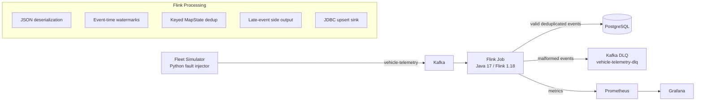

# Reliability Stream System

A reliability-focused streaming data platform for connected vehicle telemetry.

This project simulates a real-time fleet telemetry pipeline and implements the failure-handling logic that production event streams need: out-of-order events, late arrivals, duplicate retries, malformed payloads, stateful recovery, observability, and replay-safe persistence.

The goal is not only to move messages from Kafka to a database. The goal is to keep downstream state correct when the input stream is imperfect.

## Highlights

- **11.8K events/sec producer-side throughput** on a local single-machine Docker setup.
- **50,000 / 50,000 events persisted** in the throughput benchmark.
- **0 duplicate event IDs persisted** after a 5x duplicate injection test.
- **2s TaskManager crash recovery observation** before new data resumed landing in PostgreSQL.
- **Stateful Flink processing** with event-time watermarks, keyed deduplication, side outputs, and checkpointing.
- **Operational testbed** with Kafka, Flink, PostgreSQL, Prometheus, and Grafana running through Docker Compose.

## Why This Project Exists

Connected vehicles often send telemetry over unstable networks. Vehicles can disconnect, buffer events locally, retry sends, replay old messages, or reconnect with bursty traffic. A naive consumer can store duplicates, process stale state, crash on malformed data, or lose visibility into reliability failures.

This project models those conditions and implements a stream processor that handles them explicitly.

Core reliability problems covered:

- out-of-order event delivery
- late events based on event time
- duplicate event retries
- malformed JSON payloads
- sink idempotency
- TaskManager restart recovery
- metrics for processed, duplicate, late, and DLQ events

## Architecture



## Tech Stack

| Layer | Technology |
| --- | --- |
| Stream processing | Apache Flink 1.18.1, Java 17 |
| Message broker | Kafka, ZooKeeper, Confluent Platform images |
| Storage | PostgreSQL 16 |
| Simulator | Python, kafka-python |
| Observability | Prometheus, Grafana, Flink Prometheus reporter |
| Local orchestration | Docker Compose |
| Build | Maven, Maven Shade Plugin |

## Repository Layout

```text
.
├── docs/
│   └── design.md                  # Design notes and phase plan
├── fleet-simulator/
│   ├── requirements.txt
│   └── src/generator.py           # Telemetry generator with fault injection
├── flink-job/
│   ├── pom.xml
│   └── src/main/java/com/vehicletelemetry/
│       ├── TelemetryJob.java      # Flink pipeline, watermarks, state, metrics
│       ├── model/TelemetryEvent.java
│       ├── serde/TelemetryEventDeserializer.java
│       └── sink/PostgresSink.java # Idempotent PostgreSQL sink
├── infra/
│   ├── docker-compose.yml         # Kafka, Flink, PostgreSQL, Prometheus, Grafana
│   └── prometheus/prometheus.yml
└── scripts/
    ├── start.sh                   # Start local infrastructure and Kafka topics
    ├── stop.sh
    └── chaos-test.sh              # End-to-end reliability validation
```

## Event Model

Each telemetry message uses a common envelope:

```json
{
  "event_id": "uuid",
  "vehicle_id": "vehicle-001",
  "event_time": 1710000000000,
  "ingest_time": 1710000000100,
  "schema_version": "1.0",
  "event_type": "LOCATION",
  "payload": {
    "latitude": 47.6062,
    "longitude": -122.3321,
    "altitude": 100.0,
    "heading": 90.0
  }
}
```

Supported simulated event types:

- `LOCATION`
- `BATTERY`
- `SPEED`
- malformed JSON for DLQ validation

## Reliability Design

### Event-Time Processing

The Flink job assigns timestamps from `event_time`, not processing time. It uses bounded out-of-orderness watermarks with idle-source detection so temporarily quiet partitions do not block progress.

Current settings:

- watermark disorder tolerance: `30s`
- source idleness: `10s`
- late-event threshold after watermark: `45s`

### Deduplication

Events are keyed by `vehicle_id`, and recently seen `event_id` values are tracked in Flink `MapState`.

Duplicate behavior:

- first event with an `event_id` is processed
- later events with the same `event_id` are routed to duplicate side output
- duplicate counter is exported through Flink metrics
- dedup state is cleaned with processing-time timers

Current dedup retention:

- `5 minutes`

### Idempotent Sink

PostgreSQL writes use an idempotent insert:

```sql
INSERT INTO telemetry_events (...)
VALUES (...)
ON CONFLICT (event_id) DO NOTHING;
```

This gives the sink an additional correctness boundary in case an event is replayed or the job retries a write.

### Dead Letter Handling

Malformed JSON is converted into a poison-pill `TelemetryEvent` with `event_type = "PARSE_ERROR"` instead of crashing the Flink job. These records are routed to the Kafka DLQ topic:

```text
vehicle-telemetry-dlq
```

### Recovery

The local Flink cluster is configured with checkpointing and RocksDB state backend in Docker Compose:

```text
execution.checkpointing.interval: 30s
state.backend: rocksdb
```

The chaos test restarts the TaskManager container and verifies that new events continue to land in PostgreSQL after recovery.

## Benchmarks

These numbers were measured on a local single-machine Docker setup and are intended as a development baseline, not a cloud-scale claim.

| Test | Result |
| --- | --- |
| Producer throughput | `50,000` events in `4.2s`, about `11,834 events/sec` |
| Persistence correctness | `50,000 / 50,000` events landed in PostgreSQL |
| Duplicate injection | `1,000` unique events sent `5x` each, `0` duplicate event IDs in DB |
| TaskManager restart recovery | New PostgreSQL row observed after `2s` |
| Chaos suite | `7/7` reliability checks passed in the latest recorded run |

Sample benchmark output:

```text
Produced 50000 events in 4.2s = 11834 events/sec

Total rows: 51000
Duplicate event_ids in DB: 0

Before crash: 51018
Recovery: new data at 2s (rows: 51018 -> 51019)
```

## Running Locally

### Prerequisites

- Docker and Docker Compose
- Java 17
- Maven
- Python 3

Install Python dependencies:

```bash
cd fleet-simulator
python3 -m pip install -r requirements.txt
```

### Start Infrastructure

```bash
./scripts/start.sh
```

This starts:

- Kafka on `localhost:9092`
- Flink UI on `http://localhost:8081`
- PostgreSQL on `localhost:5432`
- Prometheus on `http://localhost:9090`
- Grafana on `http://localhost:3000`

### Create PostgreSQL Table

If the database is empty, create the sink table:

```bash
docker exec -i postgres psql -U telemetry -d telemetry <<'SQL'
CREATE TABLE IF NOT EXISTS telemetry_events (
    event_id TEXT PRIMARY KEY,
    vehicle_id TEXT NOT NULL,
    event_time BIGINT NOT NULL,
    ingest_time BIGINT NOT NULL,
    event_type TEXT NOT NULL,
    payload_json JSONB NOT NULL
);
SQL
```

### Build the Flink Job

```bash
mvn -f flink-job/pom.xml clean package
```

### Submit the Flink Job

Run from the repository root:

```bash
docker cp flink-job/target/flink-job-1.0-SNAPSHOT.jar flink-jobmanager:/tmp/
docker exec flink-jobmanager flink run -d /tmp/flink-job-1.0-SNAPSHOT.jar
```

### Run the Simulator

```bash
cd fleet-simulator && python3 src/generator.py
```

The generator injects:

- `5%` duplicate events
- `10%` out-of-order events
- `3%` late events
- `2%` malformed events

### Run Chaos Tests

```bash
./scripts/chaos-test.sh
```

The test suite validates:

- normal event processing
- duplicate suppression
- duplicate metrics
- malformed event DLQ routing
- DLQ metrics
- TaskManager restart recovery
- no duplicate rows after recovery

## Observability

The Flink job exports custom counters under the `telemetry` metric group:

- `events_processed`
- `events_duplicate`
- `events_late`
- `events_dlq`

Prometheus scrapes the Flink JobManager and TaskManager through the Flink Prometheus reporter on port `9249`.

Example Prometheus metric names include:

```text
flink_taskmanager_job_task_operator_telemetry_events_processed
flink_taskmanager_job_task_operator_telemetry_events_duplicate
flink_taskmanager_job_task_operator_telemetry_events_late
flink_taskmanager_job_task_operator_telemetry_events_dlq
```

## Engineering Tradeoffs

This project is intentionally scoped as a local reliability lab rather than a fully managed production deployment.

Important choices:

- **At-least-once processing plus idempotent sink** was chosen over claiming full end-to-end exactly-once semantics.
- **PostgreSQL** is used as an inspectable correctness sink, not as the only possible production sink.
- **MapState deduplication** keeps the implementation explicit and testable for interview discussion.
- **Synthetic fault injection** makes reliability behavior reproducible without depending on external services.
- **Docker Compose** keeps the project runnable on one machine for review and demonstration.

## What I Would Improve Next

- Add Testcontainers-based integration tests for the Flink job.
- Persist benchmark results as versioned reports under `docs/benchmarks/`.
- Add a Grafana dashboard JSON export to the repository.
- Move runtime configuration into environment variables.
- Add schema registry compatibility tests for event evolution.
- Add savepoint-based upgrade and rollback workflows.

## Interview Discussion Points

This project is useful for discussing:

- event time vs processing time
- watermark tuning and late data semantics
- state TTL and memory growth
- exactly-once vs idempotent at-least-once design
- Kafka partitioning by entity key
- Flink checkpointing and restart behavior
- operational metrics for data quality
- failure-oriented system validation

## Status

The current implementation includes the full local path from telemetry generation to Kafka, Flink processing, PostgreSQL persistence, DLQ routing, Prometheus metrics, and chaos validation.
